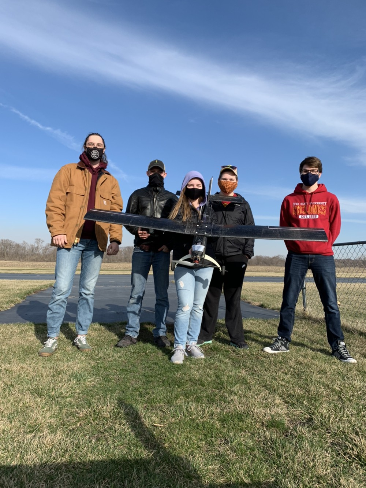

# Open UAS 1.0 

A carbon fiber edtion of the OpenUAS project, built in 2020.
#

More information can be found on the [Laboratory for Temporal Logic Youtube Page](https://www.youtube.com/watch?v=xZF81fSSzbI).
### Requirements include:

1. Configurable: Wings can be changed
2. Can break down and moved easily
3. Simple assembly
4. Does not require a runway
5. Can be manufactured by hobbyist
6. Can withstand a crash landing

### Design Goals
Development for design goals began in 2019.

Overall weight: 4.138 lbs

### Lessons Learned
\
The next iteration must have the following capabilities:
- Better access to electronics
- Better flight characteristics
- Better reparability
- Tailwheel configuration is harder to control
- Better Manufacturability
- Better transportability (multiple piece wing)
- Better corrective action for left turning tendencies

### Team 
Team Members from left to right: Will Burken, John Edgren, Ellie Diersen, Marcella Anderson, Colton Glick, John Levandowski (not pictured), Christopher Johannsen (not pictured), Stephanie Jou (not pictured)
#

