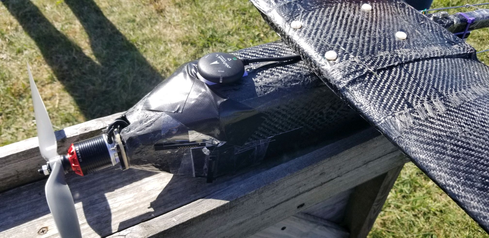

# Open UAS 1.0 

A carbon fiber edtion of the OpenUAS project, built in 2020. 

Requirements include:
1. Configurable: Wings can be changed
  - More information about [wing structure](../../docs/Legacy/Archive/Structures/wingconstruction.pdf)
3. Can break down and moved easily
4. Simple assembly
5. Does not require a runway
6. Can be manufactured by hobbyist
7. Can withstand a crash landing

Development for design goals began in 2019. More information can be found [here](../../docs/Legacy/Archive/Design/Design_1.pdf).

Lessons Learned:
The next iteration must have the following capabilities.
- Better access to electronics
- Better flight characteristics
- Better reparability
- Tailwheel configuration is harder to control
- Better Manufacturability
- Better transportability (multiple piece wing)
- Better corrective action for left turning tendencies
