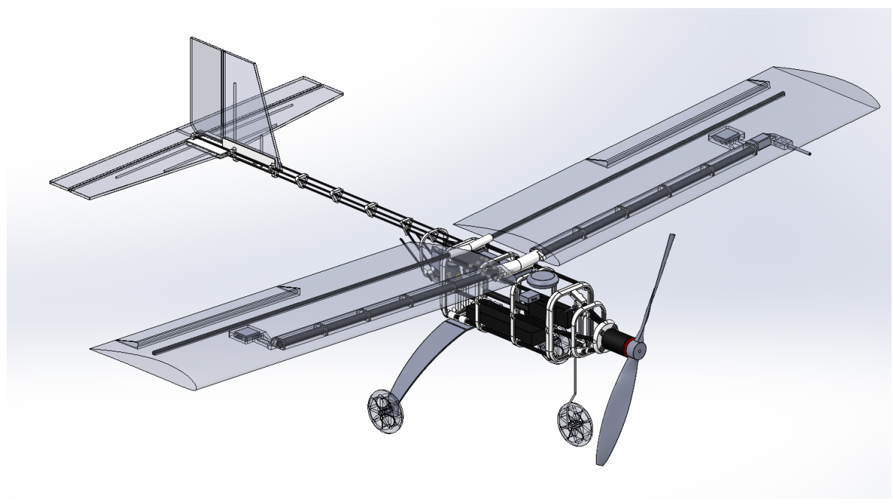
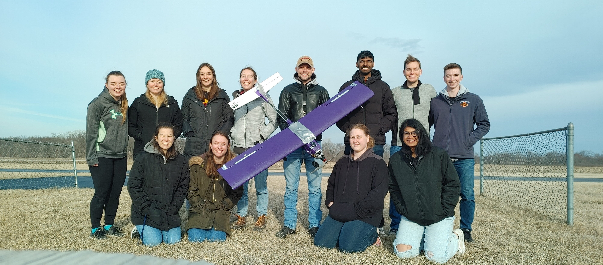

# Open UAS 2.0 
## Summary  
The OpenUAS 2.0 model has a major focus on the use of 3D printed parts to create a framework that can be easily modfided and printed to meet the needs for anyone wanting to use the model. It has an overall weight of 4.07 lbs, keeping it lightweight. It is also adaptable to store more electronics than OpenUAS 1.0 and other UAVs. 

## Solidworks Assembly

#

## Spring 2022 Design Changes

There were a few issues that arose with the construction of the 2nd iteration of the OpenUAS project. These were mostly forecasted issues the team had planned mitigation methods for, but  that ended up not working the intended way. There were a few issues that arose that were not foreseen but directly related to the predicted issues. 

## The First Major Area of Issue 
The issues we were faced with all revolved around the tail of the UAS. The original idea was to create a tail that's lightweight and easily replaceable. In order to do this the tail was broken down into a few different parts. These included the carbon fiber support rod, and 3D printed parts including: tail supports, tail feather support, and connection rod of the tail.  

### Twisting of the tail 
The first issue that arose was the amount of twist that appeared in the end of the tail around the tail feather piece. We predicted that there would be a small amount of twist due to using 3 Carbon Fibers rods as the main part of the tail. We believed that it would be negligible, however once the tail was assembled it was clear the twisting was going to be more of an issue then originally predicted.  

One way we attempted to fix this issue was adding more of the tail support pieces in order to add more stiffness along the carbon fiber rods. While this did decrease the amount of twist noticeably, it still did not remove the problem. Other proposed ideas for fixing for the issue was adding a stiffer such as balsa wood or popsicle sticks was taken into consideration however, while working to find a solution the team ran into another issue. 

### Connection between the body and the tail 

Another issue we ran into was not one that we had predicted. When designing the 3D pieces the team created generic ribs that would be used to create the body of the UAS. There were a few assumptions made however when applying the concept of the hinge ribs with the interfacing parts such as the back connection point and the nose cone connection. 

One of the assumptions made was that the 3D printed parts would be printed to a high enough tolerance that connecting with glue while flush with each other would be a quick and easy method of connecting and if needed later removing from each other without having to completely disassemble the body or tail parts. This proved to not be the case when the time came to connect the two parts. 

One thing that had been overlooked with the 3D printed parts was the flexibility of the pieces. ABS was the material used to print the ribs and the connection piece and while the material considered relatively stiff for our needs the material is still able to bend or warp without losing its shape if a force applied to it. When we went to attach the parts together, we clamped the two of them together; it became hard to hold them together while the glue set and the final product was not within the desired tolerance of connection. Instead of a solid connection we had half of the connection bowing outwards towards the end of the tail instead of inwards toward the body like we had planned. 

The issue was made worse when the control surfaces were added to the tail feather and it was clear the added weight was making the problem worse. Much like the twisting problem we had a number of proposed ideas in order to correct the issue. Looking at table 1.

### Table 1
Solution | How it would fix the problem | Why we went with it or not | Was it the final solution we picked? |
|:----:|:---------------------------------------------------------------|:--------------------------------------------------------------------------|:---------:|
| Elastic bands | The elastic bands would be fastened to the top of the tail piece and then would be wrapped and unwrapped around a part connected to the body of the UAS when accessing the electronics. | After creating a mock-up setup of the idea using string we determined that the flexibility of the ABS material was keeping us from properly tensioning the string and would not be a great solution to the issue. | No |
| Velcro | The top surface of the body and the tail connection piece are meant to be flush when assembled. In order to keep the tail piece from bowing backwards velcro would be placed along the top of the back rib and the connection tailpiece. When we need access to the electronics and interior of the UAS the top piece of velcro would be removed in order to allow the hinge to work correctly. | When we tested the idea by placing velcro pieces on the surface it was seen that the bowing still occurred. Not only that but when moving the UAS the velcro came loose and was not effective.  | No |
| Rod method 1 | This method would include attaching another carbon fiber rod at the base of the body and the end of the tail feather diagonally to force the tail piece upwards. | This method would have been hard to add to the current design as is and runs the risk of breaking during rough landings. | No |
| Rod method 2 | Similar to the 1st rod method the 2nd would involve adding a new rod. A big difference in the method would be removing the 3 smaller carbon fiber rods and replacing them with one large rod that would run from the nose cone to the end of the tail.Instead of adding the diagonal support from the body to the tail. | Like the first rod method we would have to re-design the 3D printed parts. In this case we decided that this approach would be effective in fixing the issue in the smallest amount of time and amount of labor. It would also result in fixing the issue with the twist of the tail feather. | Yes |

## Our solution to the First Issue 
After mocking up and reviewing different ideas between the sub-teams we determined that using the 2nd rod method would be our best course of action. This was based on the fact the rod would not only fix the issue with the bowing but it would also address the twisting problem in the tail at the same time. 

We were not able to mock up this idea in our lab space however, we were able to compare the stiffness from the assembled tail and the singular rod we would add. We did this by applying a small amount of force on each of the structures to determine how much bending would occur. (should we measure the amount of bending for quantitative data(plus another table would be cool))
Once we determined that the singular rod would be the best solution to reduce the bowing in the part we took a look at the twisting. In order to incorporate the rod we had to redesign the tail feather and connection parts. Our theory is that by taking the time to redesign the tail feather we can reduce the twisting at the end of the tail. Primary because the bowing and bending of the 3 carbon fiber rods will no longer be a problem when the tail is one solid rod along the length of the UAS’s body and tail.

## Second Area of Issue 

After the assmebly of the new tail was completed we came across another issue with the 2.0 model. The issue this time instead of being around the tail was the on the body/fuselogde of the model. This model includes the use of neodynimum magnets inorder to keep the clam shell design closed during however, it was discovered that the smaller magnets were not strong enough to hold the shell closed under minor turbulance. 

### Table 2 
Solution | How it would fix the problem | Why we went with it or not | Was it the final solution we picked? |
|:----:|:---------------------------------------------------------------|:--------------------------------------------------------------------------|:---------:|
| Velcro| The Velcro would be able to hold the two halfs closed during flight| We chose not to go with this soultion as there was not enough surface area for the velcro to be affective. | No |
| Zip Ties | Zip Ties is somthing we chose to use as a short term solution in order to close the clam shell | long term the soultion this is not sustanble as the zip ties would have to be cut and a new one to replace them each time we wanted access to the electronics | No |
| 3D Printed Part | A 3D printed part would be more of an insert piece that would screwed together in order to keep the two halfs closed | This was our chosen soultion as it would not add a lot to the system and would a good fit for the part | Yes |

# Spring 2023 Changes 

The changes made during this round were needed for fine tuning of components for the function of the model instead of fixing dramic issues with model like previous changes.  

## Motor Mount Adjustment

After some observions of other air crafts we noticed that the motors for the propeller may benfit from an angled motor instead of a completly straight faceing. We angled our motor to the right and directed down of the model. In order to do this we added nuts to the motor bolts to create the spacing for the angle. This inculded four mounting points and a total of 5 nuts. Two of the nuts were placed on the upper right corner and the upper left corner. 

## Test Flight

