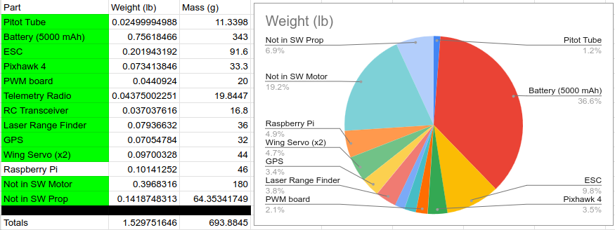

# Hardware Components

### Flight Controller: Holybro Pixhawk 4
- Dimensions: 44 x 84 x 12 mm
- Weight (plastic case): 33.3 grams
- https://shop.holybro.com/pixhawk-4_p1089.html

### GPS: Holybro Pixhawk 4 Neo-M8N GPS
- Dimensions: 25 x 25 x 4 mm 
- Weight: 32 grams
- http://www.holybro.com/product/pixhawk-4-gps-module/

### Power Module: Holybro APM Power Module 12S - PM02 V3
- Dimensions: 18 x 23 mm
- Weight: 20 grams
- http://www.holybro.com/product/power-modulepm02-v3/

### Airspeed Sensor: Holybro Digital Air Speed Sensor
- Dimensions: (see below)
- Weight: 11.3398 grams
- https://shop.holybro.com/digital-air-speed-sensor_p1029.html?
	
### RC Transceiver: FrSky X8R 8/16ChS.Bus ACCST Telemetry Receiver W/Smart Port
- Dimensions: 46.5 x 27 x 14 mm
- Weight: 16.8 grams
- https://hobbyking.com/en_us/frsky-x8r-8-16ch-s-bus-accst-telemetry-receiver-w-smart-port-no-antenna-cover.html

### RC Controller: FrSky Taranis X9D plus
- (EXTERNAL TO UAS)

### Telemetry Transceiver: Holybro 433Mhz 915Mhz Transceiver Radio Telemetry Set
- Dimensions: 28 x 53 x 10.7 mm (without antenna), 10 dia x 107 mm (antenna)
- Weight: 19.8447 grams
- https://shop.holybro.com/transceiver-telemetry-radio-set-v3_p1103.html?

### ESC: BadAss Renegade 85A ESC
- Dimensions: 86mm x 33mm x 16 mm
- Weight: 91.6 grams
- https://badasspower.com/badass-renegade-series-brushless-esc-85a.html

### Motor: BadAss 2826-690Kv brushless motor
- Dimensions: (see below)
- Weight: 180 grams
- https://badasspower.com/badass-2826-690kv-brushless-motor.html

### Propellor: APC 14x12 E
- Dimensions: 355.6 mm long, 28.702 mm diameter round part, 17.018 mm thickness
- Weight: 64.35341749 grams
- https://www.apcprop.com/product/14x12/

### Battery: Ovonic 5000mAh 11.1V 3S 50C 3 Cell LiPo
- Dimensions: 155 mm x 43 mm x 25 mm
- Weight: 343 grams
- https://www.amazon.com/5000mAh-Battery-Traxxas-Brushless-Spartan/dp/B07L6C7BX9

### Distance sensor (laser range finder): Lightware SF11/C 
- Dimensions: (see below)
- Weight: 35 grams
- https://acroname.com/store/laser-range-sensor-r395-sf11-c

### Corona DS-239HV Digital Slim Wing Servo (Metal Gear)
- Dimensions: (see below)
- Weight: 22 grams
- https://hobbyking.com/en_us/corona-ds-239hv-digital-slim-wing-servo-metal-gear-4-6kg-0-13sec-22g.html?wrh_pdp=2&utm_source=google&utm_medium=cpc&utm_campaign=google_us_shopping&countrycode=US&gclid=CjwKCAjw9LSSBhBsEiwAKtf0n35Uvf30IQGUqrNItFsiKAyhuMXt65QkxqWKiIHLzyG5t3DQtI5aUxoCoyMQAvD_BwE&gclid=CjwKCAjw9LSSBhBsEiwAKtf0n35Uvf30IQGUqrNItFsiKAyhuMXt65QkxqWKiIHLzyG5t3DQtI5aUxoCoyMQAvD_BwE

## Weights

