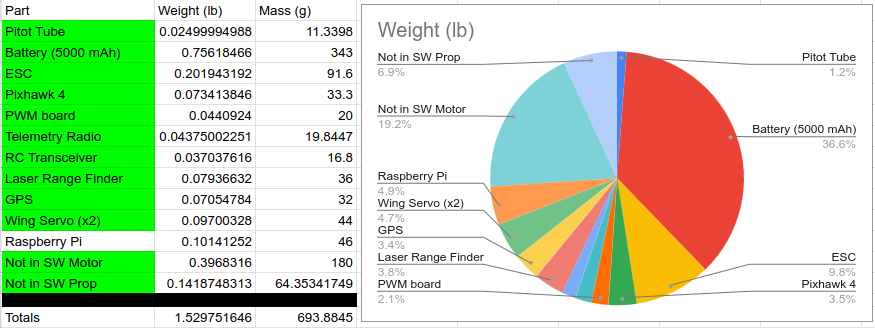

# Hardware Components

### [Flight Controller: Holybro Pixhawk 4](https://shop.holybro.com/pixhawk-4_p1089.html)
- Dimensions: 44 x 84 x 12 mm
- Weight (plastic case): 33.3 grams

### [GPS: Holybro Pixhawk 4 Neo-M8N GPS](http://www.holybro.com/product/pixhawk-4-gps-module/)
- Dimensions: 25 x 25 x 4 mm 
- Weight: 32 grams

### [Power Module: Holybro APM Power Module 12S - PM02 V3](http://www.holybro.com/product/power-modulepm02-v3/)
- Dimensions: 18 x 23 mm
- Weight: 20 grams

### [Airspeed Sensor: Holybro Digital Air Speed Sensor](https://shop.holybro.com/digital-air-speed-sensor_p1029.html?)
- Dimensions: (see below)
- Weight: 11.3398 grams
	
### [RC Transceiver: FrSky X8R 8/16ChS.Bus ACCST Telemetry Receiver W/Smart Port](https://hobbyking.com/en_us/frsky-x8r-8-16ch-s-bus-accst-telemetry-receiver-w-smart-port-no-antenna-cover.html)

- Dimensions: 46.5 x 27 x 14 mm
- Weight: 16.8 grams

### [Telemetry Transceiver: Holybro 433Mhz 915Mhz Transceiver Radio Telemetry Set](https://shop.holybro.com/transceiver-telemetry-radio-set-v3_p1103.html?)
- Dimensions: 28 x 53 x 10.7 mm (without antenna), 10 dia x 107 mm (antenna)
- Weight: 19.8447 grams

### [ESC: BadAss Renegade 85A ESC](https://badasspower.com/badass-renegade-series-brushless-esc-85a.html)

- Dimensions: 86mm x 33mm x 16 mm
- Weight: 91.6 grams

### [Motor: BadAss 2826-690Kv brushless motor](https://badasspower.com/badass-2826-690kv-brushless-motor.html)
- Dimensions: (see below)
- Weight: 180 grams

### [Propeller: APC 14x12 E](https://www.apcprop.com/product/14x12/)
- Dimensions: 355.6 mm long, 28.702 mm diameter round part, 17.018 mm thickness
- Weight: 64.35341749 grams

### [Battery: Ovonic 5000mAh 11.1V 3S 50C 3 Cell LiPo](https://www.amazon.com/5000mAh-Battery-Traxxas-Brushless-Spartan/dp/B07L6C7BX9)
- Dimensions: 155 mm x 43 mm x 25 mm
- Weight: 343 grams

### [Distance sensor (laser range finder): Lightware SF11/C](https://acroname.com/store/laser-range-sensor-r395-sf11-c) 
- Dimensions: (see below)
- Weight: 35 grams

### [Corona DS-239HV Digital Slim Wing Servo (Metal Gear)](https://hobbyking.com/en_us/corona-ds-239hv-digital-slim-wing-servo-metal-gear-4-6kg-0-13sec-22g.html)
- Dimensions: (see below)
- Weight: 22 grams

### [RC Controller: RadioMaster TX16S](https://radiomasterrc.com/products/tx16s-mk3-radio-controller)
- Dimensions: 287 mm x 193 mm x 129 mm  
- Weight: 820 grams (without battery)
- 16-channel radio transmitter used by the pilot to manually control the aircraft during flight.
- Sends control inputs such as throttle, roll, pitch, and yaw to the onboard RC receiver.
- Supports multiple RF protocols and is compatible with receivers such as FrSky, ELRS, and Crossfire depending on module configuration.
- Equipped with Hall-effect gimbals for precise and smooth control inputs.
- Includes a built-in LCD display for model setup, telemetry monitoring, and system configuration.
- Displays telemetry data such as battery voltage and signal strength from the aircraft.
- Operated by the pilot on the ground and **external to the UAS airframe**.

## Weights

