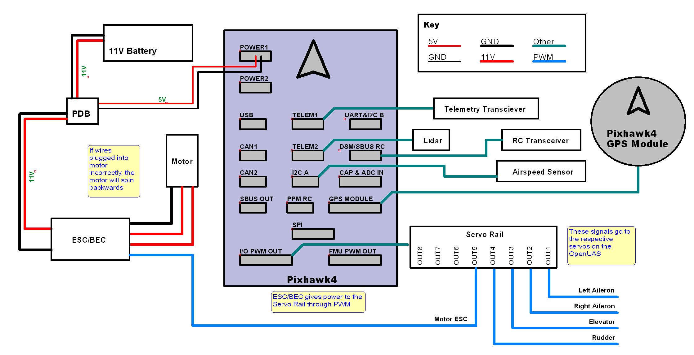

# Electrical

Here you will find details on the electrical system on the current OpenUAS vehicle, including wiring diagrams, recommended components, and device pin-outs.

## Current Wiring Diagram

## Pixhawk 4 Pinout
[Pixhawk 4 Pinout](/Pixhawk4-Pinouts.pdf)