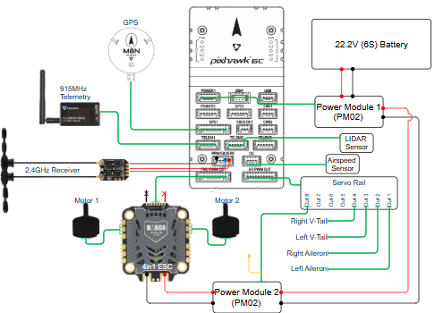

# Electrical

Here, you will find details on the electrical system on the current OpenUAS vehicle, including wiring diagrams, recommended components, and device pin-outs.

## PLUMA Wiring Diagram

## Apprentice and 3.0 Wiring Diagram

## Pixhawk 4 Pinout
[Pixhawk 4 Pinout](/Pixhawk4-Pinouts.pdf)
## testing
