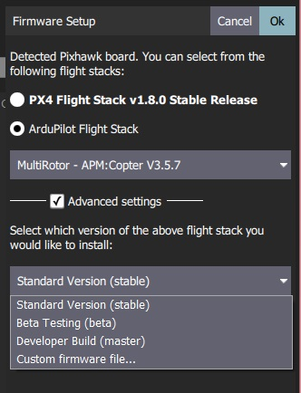

# PX4

PX4 autopilot is the main software stack that controls the UAS. It has been forked to the [OpenUAS repo](https://github.com/Open-UAS/PX4-Autopilot) to allow our own custom modifications. The upstream repo can be viewed at, [github.com/PX4/PX4-Autopilot](https://github.com/PX4/PX4-Autopilot)

PX4 allows for many out of the box capabilities such as flight stabilization, automatic flight paths, and automatic take off. Further details about PX4's features can be found in the [PX4 documentation](https://docs.px4.io/main/en/)

## Dev Environment Setup
This setup can get fairly complicated with all the dependencies that PX4 requires. A new method that alleviates some of this is using a docker container to compile PX4. This pre-packages the dependencies required to build PX4

### Using the Docker Toolchain

**Windows**
- Be sure virtualization is enabled on your machine through the bios.
- Install Windows Subsystem for Linux 2 (WSL 2) by opening an *administrator* command prompt and running `wsl --install --distribution Ubuntu-20.04`
- Reboot your machine 
- Install Docker Desktop with WSL2 backend, [Docker, Windows install](https://docs.docker.com/desktop/install/windows-install/)
- Once your development tools are all setup, go ahead and use git to clone the OpenUAS PX4-autopilot repository from [https://github.com/Open-UAS/PX4-Autopilot](https://github.com/Open-UAS/PX4-Autopilot) and checkout the stable branch.

**Linux**
- Install docker engine, [https://docs.docker.com/engine/install/ubuntu/](https://docs.docker.com/engine/install/ubuntu/)
- Once your development tools are all setup, go ahead and clone the OpenUAS PX4-autopilot repository from [https://github.com/Open-UAS/PX4-Autopilot](https://github.com/Open-UAS/PX4-Autopilot) and checkout the stable branch.

### Native Setup

**Native Windows**
:::warning
This configuration will not be able to run the gazebo simulation.
Gazebo is a Linux only software so it must be run through WSL or natively on Linux.
:::
- Details on this configuration may be lacking as not many people have used it before. 
- Check the PX4 docs for this configuration [https://docs.px4.io/main/en/dev_setup/dev_env_windows_cygwin.html](https://docs.px4.io/main/en/dev_setup/dev_env_windows_cygwin.html)

**Windows with WSL 2**
- Install WSL 2 with Ubuntu 20.04.1 LTS [https://docs.microsoft.com/en-us/windows/wsl/install](https://docs.microsoft.com/en-us/windows/wsl/install)
- Once your development tools are all setup, go ahead and clone the OpenUAS PX4-autopilot repository from [https://github.com/Open-UAS/PX4-Autopilot](https://github.com/Open-UAS/PX4-Autopilot) and checkout the stable branch.

**Linux**
TODO

## Building and Flashing Custom Firmware
See [Dev Environment Setup](#dev-environment-setup) for setup details.

### Building with Docker
- Open a linux terminal to the root of the PX4 folder structure.
- Be sure the docker daemon is running by opening docker desktop on windows.
- Run `./Tools/docker_run.sh make px4_fmu-v5_default`. This will start a new docker container and compile the firmware for Pixhawk 4.
    - Using the docker build script follows this format, `./Tools/docker_run.sh {command to execute}`
        - `./Tools/docker_run.sh bash` can be run to look around in the docker container file system 
    - See [Building PX4](https://docs.px4.io/main/en/dev_setup/building_px4.html#nuttx-pixhawk-based-boards) for all available targets
- Once compilation is complete the firmware will be under the `build` folder as `px4_fmu-v5_default.px4` among other files.

### Building Natively 
- Open a terminal to the root of the PX4 folder structure.
- Run `make px4_fmu-v5_default`.
    - See [Building PX4](https://docs.px4.io/main/en/dev_setup/building_px4.html) for all available targets
- Once compilation is complete the firmware will be under the `build` folder as `px4_fmu-v5_default.px4` among other files.

### Flash Firmware With QGroundControl
- Open QGC and go to vehicle setup, then firmware tab.
- Plug the Pixhawk 4 into your machine via USB, it should auto detect and QGC will prompt you what firmware to flash.
- Select advanced settings, and set the custom firmware file option in the version drop down.

- Select our newly created `PX4_fmu-v5_default.px4` file and click ok to start flashing.
- Wait for the Pixhawk to reboot to complete the update.

## Custom Airframes

Within PX4 there are definitions called [airframes](https://docs.px4.io/main/en/dev_airframes/#airframes). These definitions control things like, number of control surfaces, propeller configurations, and vehicle parameters among other settings. PX4 comes [pre-loaded](https://docs.px4.io/main/en/airframes/airframe_reference.html) with many airframes, but we can add our own custom airframes to support configuration and modification efforts. 

The PX4 docs have a great step by step guide for adding a new airframe [here](https://docs.px4.io/main/en/dev_airframes/adding_a_new_frame.html).

In this documentation we will cover what has been added to stock PX4 to get the new airframes setup.

### OpenUAS Airframe (2150)

This airframe is intended for the current OpenUAS vehicle and should be adapted and modified as the physical design changes.

- Created new config file in [ROMFS/px4fmu_common/init.d/airframes](https://github.com/Open-UAS/PX4-Autopilot/blob/stable/ROMFS/px4fmu_common/init.d/airframes/2150_open_uas) and [ROMFS/px4fmu_common/init.d-posix/airframes](https://github.com/Open-UAS/PX4-Autopilot/blob/stable/ROMFS/px4fmu_common/init.d-posix/airframes/2150_open_uas) (the posix folder is used by the gazebo simulation while the non-posix folder is used by the Pixhawk. The config files' content should be identical) with the autostart id prepended to the filename.
-  Added the new config file to the airframe CMakeLists.txt file in each folder, [ROMFS/init.d/airframes/CMakeLists.txt](https://github.com/Open-UAS/PX4-Autopilot/blob/stable/ROMFS/px4fmu_common/init.d/airframes/CMakeLists.txt#L47) and [ROMFS/init.d-posix/airframes/CMakeLists.txt](https://github.com/Open-UAS/PX4-Autopilot/blob/stable/ROMFS/px4fmu_common/init.d-posix/airframes/CMakeLists.txt#L75)
- Added OpenUAS mixer to [/ROMFS/px4mu_common/mixers/](https://github.com/Open-UAS/PX4-Autopilot/blob/stable/ROMFS/px4fmu_common/mixers/open_uas_apprentice.main.mix)
    - Which mixer to use is set in the airframe config file created earlier.
    - [See below](#openuas-mixer) for more details on mixers. 

See [Using The OpenUAS Airframe](./QGroundControl.md#using-the-openuas-airframe) for details and enabling the new airframe in QGC.

### Apprentice Airframe (2151)

This airframe is intended to run on the Apprentice aircraft that we utilize for other development tasks. This airframe was not utilized as much as the other so may not be up to date. 

A similar approach was taken to add this custom airframe as previous.

- Add the new config file to [ROMFS/px4fmu_common/init.d/airframes/](https://github.com/Open-UAS/PX4-Autopilot/blob/stable/ROMFS/px4fmu_common/init.d/airframes/2151_open_uas_apprentice)
- Add the config file to the [CMakeLists.txt](https://github.com/Open-UAS/PX4-Autopilot/blob/stable/ROMFS/px4fmu_common/init.d/airframes/CMakeLists.txt#L48) file

## OpenUAS Mixer
[Mixers](https://docs.px4.io/main/en/concept/mixing.html) are used to take commands (roll, pitch, yaw, throttle) from the PX4 system and map those commands to actuator outputs, including servo mapping, min and max values, and direction. This is preferable to mapping the outputs with the RC controller because the autopilot will utilize the mixer and not the RC controller mappings. Meaning the trims, and servo mappings can be applied system wide.

The mixer for the custom airframes are defined in the `ROMFS/px4fmu_common/mixers` folder eg [open_uas_apprentice.main.mix](https://github.com/Open-UAS/PX4-Autopilot/blob/stable/ROMFS/px4fmu_common/mixers/open_uas_apprentice.main.mix) . The mixer files can get somewhat confusing to understand, details on writing mixers can be found on the [PX4 docs](https://docs.px4.io/main/en/concept/mixing.html#px4-mixer-definitions). The general idea is that you have n number of actuator outputs, each of those n actuators are defined to be driven by 1 or more outputs from PX4. The mixer file is defined sequentially, starting with actuator 1, then 2, 3 ... to n actuators. These actuator numbers correspond to the pwm port number on the [Pixhawk wiring](http://localhost:8080/Electrical/#current-wiring-diagram). 

The default mixer file can be **overridden** at runtime by placing the mix file with the same name (eg `open_uas_apprentice.main.mix`) onto the Pixhawk SD card under `/etc/mixers/` This mix file will be loaded instead of the default one defined at compile time.
