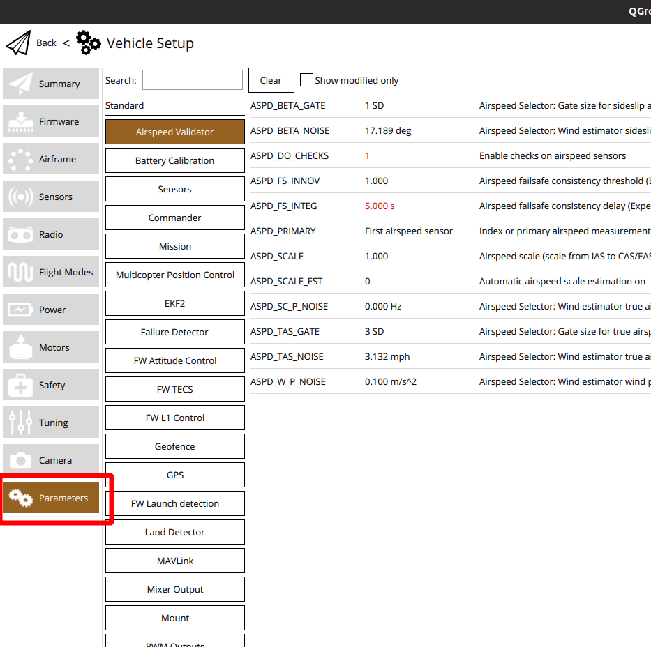

# PX4

PX4 autopilot is the main software stack that controls the UAS. It has been forked to the [OpenUAS repo](https://github.com/Open-UAS/PX4-Autopilot) to allow our own custom modifications. The upstream repo can be viewed at, [github.com/PX4/PX4-Autopilot](https://github.com/PX4/PX4-Autopilot)

PX4 allows for many out of the box capabilities such as flight stabilization, automatic flight paths, and automatic take off. Further details about PX4's features can be found in the [PX4 documentation](https://docs.px4.io/main/en/)

## Dev Environment Setup
This setup can get fairly complicated with all the dependencies that PX4 requires. A new method that alleviates some of this is using a docker container to compile PX4. This pre-packages the dependencies required to build PX4

### Using the Docker Toolchain (Recommended)

**Windows with WSL 2**
1. Be sure virtualization is enabled on your machine through the bios.
2. Install Windows Subsystem for Linux 2 (WSL 2) by opening an *administrator* command prompt and running `wsl --install --distribution Ubuntu-20.04`
3. Reboot your machine 
4. Install Docker engine through WSL2, [Docker Engine, Ubuntu install](https://docs.docker.com/engine/install/ubuntu/)
5. Do [Docker post install steps](https://docs.docker.com/engine/install/linux-postinstall/) to run docker as non-root.
6. Once your development tools are all setup, go ahead and use git to clone the OpenUAS PX4-autopilot repository from [https://github.com/Open-UAS/PX4-Autopilot](https://github.com/Open-UAS/PX4-Autopilot) and checkout the stable branch.

**Linux**
1. Install Docker engine, [Docker Engine, Ubuntu install](https://docs.docker.com/engine/install/ubuntu/)
2. Do [Docker post install steps](https://docs.docker.com/engine/install/linux-postinstall/) to run docker as non-root.
3. Once your development tools are all setup, go ahead and clone the OpenUAS PX4-autopilot repository from [https://github.com/Open-UAS/PX4-Autopilot](https://github.com/Open-UAS/PX4-Autopilot) and checkout the stable branch.

### Without Docker

**Windows with WSL 2**
1. Install Windows Subsystem for Linux 2 (WSL 2) by opening an *administrator* command prompt and running `wsl --install --distribution Ubuntu-20.04`
2. Reboot your machine 
3. Once your development tools are all setup, go ahead and clone the OpenUAS PX4-autopilot repository from [https://github.com/Open-UAS/PX4-Autopilot](https://github.com/Open-UAS/PX4-Autopilot) and checkout the stable branch.

**Ubuntu 18.04/20.04 Native/Virtual Machine*

1. Clone forked px4 repository to your machine `git clone --branch stable https://github.com/LTL-AERO/PX4-Autopilot.git`
2. Move into the newly cloned px4 repository `cd PX4-Autopilot`
3. Run `git submodule update --init --recursive` to clone all submodules within the repository, to your machine
     - alternatively `git submodule update --init --recursive <submodule folder>` can be used if you know the specific submodule needed 
     - `git submodule update --recursive` can be run in the future to update all submodules
4. Setup development environment following the steps below, retrieved from [https://dev.px4.io/master/en/setup/dev_env_linux.html](https://dev.px4.io/master/en/setup/dev_env_linux.html)
     - Run the ubuntu.sh to install the required dependencies(including gazebo for simulation):`bash ./Tools/setup/ubuntu.sh`
     - IMPORTANT for Ubuntu Focal(20.04)! `gcc-9-arm-linux-gnueabihf` is the default installation which is not fully supported, so we must manually install `gcc-8-arm-linux-gnueabihf` and set it as the default toolchain.
            - `sudo apt-get install -y gcc-8-arm-linux-gnueabihf g++-8-arm-linux-gnueabihf
sudo update-alternatives --install /usr/bin/arm-linux-gnueabihf-gcc arm-linux-gnueabihf-gcc /usr/bin/arm-linux-gnueabihf-gcc-8 100 --slave /usr/bin/arm-linux-gnueabihf-g++ arm-linux-gnueabihf-g++ /usr/bin/arm-linux-gnueabihf-g++-8
sudo update-alternatives --config arm-linux-gnueabihf-gcc`
 5. Done.
      - Steps for building PX4 firmware: [https://open-uas.github.io/Software/PX4.html#building-natively](https://open-uas.github.io/Software/PX4.html#building-natively)
      - Steps for running Gazebo: TODO

**Native Windows**
:::warning
This configuration will not be able to run the gazebo simulation.
Gazebo is a Linux only software so it must be run through WSL or natively on Linux.
:::
- Details on this configuration may be lacking as not many people have used it before. 
- Check the PX4 docs for this configuration [https://docs.px4.io/main/en/dev_setup/dev_env_windows_cygwin.html](https://docs.px4.io/main/en/dev_setup/dev_env_windows_cygwin.html)

## Building and Flashing Custom Firmware
See [Dev Environment Setup](#dev-environment-setup) for setup details.

### Building with Docker (Recommended)
1. Open a linux terminal to the root of the PX4 folder structure.
2. Be sure the docker daemon is running by running `sudo service docker start` or `sudo systemctl start docker` depending on if your distro uses SysVinit or Systemd.
3. Run `./Tools/docker_run.sh make px4_fmu-v5_default`. This will start a new docker container and compile the firmware for Pixhawk 4.
    - If you get compilation errors, it can be a good idea to run `./Tools/docker_run.sh make clean` to put the build process in a clean state
    - Using the docker build script follows this format, `./Tools/docker_run.sh {command to execute}`
        - `./Tools/docker_run.sh bash` can be run to look around in the docker container file system 
    - See [Building PX4](https://docs.px4.io/main/en/dev_setup/building_px4.html#nuttx-pixhawk-based-boards) for all available targets
4. Once compilation is complete the firmware will be under the `build` folder as `px4_fmu-v5_default.px4` among other files.

### Building on Ubuntu 18.04/20.04 Native/Virtual Machine 
- Open a linux terminal to the root of the PX4 folder structure.
- Run `make px4_fmu-v5_default`.
    - If you get compilation errors, it can be a good idea to run `make clean` to put the build process in a clean state
    - See [Building PX4](https://docs.px4.io/main/en/dev_setup/building_px4.html) for all available targets
- Once compilation is complete the firmware will be under the `build` folder as `px4_fmu-v5_default.px4` among other files.

### Flash Firmware With QGroundControl
- Open QGC and go to vehicle setup, then firmware tab.
- Plug the Pixhawk 4 into your machine via USB, it should auto detect and QGC will prompt you what firmware to flash.
- Select advanced settings, and set the custom firmware file option in the version drop down.

- Select our newly created `PX4_fmu-v5_default.px4` file and click ok to start flashing.
- Wait for the Pixhawk to reboot to complete the update.

## Custom Airframes

Within PX4 there are definitions called [airframes](https://docs.px4.io/main/en/dev_airframes/#airframes). These definitions control things like, number of control surfaces, propeller configurations, and vehicle parameters among other settings. PX4 comes [pre-loaded](https://docs.px4.io/main/en/airframes/airframe_reference.html) with many airframes, but we can add our own custom airframes to support configuration and modification efforts. 

The PX4 docs have a great step by step guide for adding a new airframe [here](https://docs.px4.io/main/en/dev_airframes/adding_a_new_frame.html).

In this documentation we will cover what has been added to stock PX4 to get the new airframes setup.

### OpenUAS Airframe (2150)

This airframe is intended for the current OpenUAS vehicle and should be adapted and modified as the physical design changes.

- Created new config file in [ROMFS/px4fmu_common/init.d/airframes](https://github.com/Open-UAS/PX4-Autopilot/blob/stable/ROMFS/px4fmu_common/init.d/airframes/2150_open_uas) and [ROMFS/px4fmu_common/init.d-posix/airframes](https://github.com/Open-UAS/PX4-Autopilot/blob/stable/ROMFS/px4fmu_common/init.d-posix/airframes/2150_open_uas) (the posix folder is used by the gazebo simulation while the non-posix folder is used by the Pixhawk. The config files' content should be identical) with the autostart id prepended to the filename.
-  Added the new config file to the airframe CMakeLists.txt file in each folder, [ROMFS/init.d/airframes/CMakeLists.txt](https://github.com/Open-UAS/PX4-Autopilot/blob/stable/ROMFS/px4fmu_common/init.d/airframes/CMakeLists.txt#L47) and [ROMFS/init.d-posix/airframes/CMakeLists.txt](https://github.com/Open-UAS/PX4-Autopilot/blob/stable/ROMFS/px4fmu_common/init.d-posix/airframes/CMakeLists.txt#L75)
- Added OpenUAS mixer to [/ROMFS/px4mu_common/mixers/](https://github.com/Open-UAS/PX4-Autopilot/blob/stable/ROMFS/px4fmu_common/mixers/open_uas_apprentice.main.mix)
    - Which mixer to use is set in the airframe config file created earlier.
    - [See below](#openuas-mixer) for more details on mixers. 

See [Using The OpenUAS Airframe](./QGroundControl.md#using-the-openuas-airframe) for details and enabling the new airframe in QGC.

### Apprentice Airframe (2151)

This airframe is intended to run on the Apprentice aircraft that we utilize for other development tasks. This airframe was not utilized as much as the other so may not be up to date. 

A similar approach was taken to add this custom airframe as previous.

- Add the new config file to [ROMFS/px4fmu_common/init.d/airframes/](https://github.com/Open-UAS/PX4-Autopilot/blob/stable/ROMFS/px4fmu_common/init.d/airframes/2151_open_uas_apprentice)
- Add the config file to the [CMakeLists.txt](https://github.com/Open-UAS/PX4-Autopilot/blob/stable/ROMFS/px4fmu_common/init.d/airframes/CMakeLists.txt#L48) file

## OpenUAS Mixer
[Mixers](https://docs.px4.io/main/en/concept/mixing.html) are used to take commands (roll, pitch, yaw, throttle) from the PX4 system and map those commands to actuator outputs, including servo mapping, min and max values, and direction. This is preferable to mapping the outputs with the RC controller because the autopilot will utilize the mixer and not the RC controller mappings. Meaning the trims, and servo mappings can be applied system wide.

The mixer for the custom airframes are defined in the `ROMFS/px4fmu_common/mixers` folder eg [open_uas_apprentice.main.mix](https://github.com/Open-UAS/PX4-Autopilot/blob/stable/ROMFS/px4fmu_common/mixers/open_uas_apprentice.main.mix) . The mixer files can get somewhat confusing to understand, details on writing mixers can be found on the [PX4 docs](https://docs.px4.io/main/en/concept/mixing.html#px4-mixer-definitions). The general idea is that you have n number of actuator outputs, each of those n actuators are defined to be driven by 1 or more outputs from PX4. The mixer file is defined sequentially, starting with actuator 1, then 2, 3 ... to n actuators. These actuator numbers correspond to the pwm port number on the [Pixhawk wiring](http://localhost:8080/Electrical/#current-wiring-diagram). 

The default mixer file can be **overridden** at runtime by placing the mix file with the same name (eg `open_uas_apprentice.main.mix`) onto the Pixhawk SD card under `/etc/mixers/` This mix file will be loaded instead of the default one defined at compile time.

## Parameters and Configuration
PX4 allows the user to control the behavior of the autopilot through hundreds of parameters. This is the main way that we customize the OpenUAS and control its behavior. 

The current parameters of the connected vehicle set can always be viewed in [QGroundControl](./QGroundControl.md) under vehicle setup > parameters.

Some parameters are initialized by the airframe definition file, ex: [PX4-Autopilot/ROMFS/px4fmu_common/init.d/airframes/2150_open_uas](https://github.com/Open-UAS/PX4-Autopilot/blob/stable/ROMFS/px4fmu_common/init.d/airframes/2150_open_uas) and some parameters are modified later by the user. Because of this, all modified parameters are reset when switching to a new airframe, but parameters are saved if the vehicle is simply powered off.

### Important Parameters

PX4 includes hundreds of parameters to modify, a full list of all available parameters can be found in the [PX4 docs](https://docs.px4.io/main/en/advanced_config/parameter_reference.html). Below are some parameters of note that we have modified in the past.

#### BAT1_CAPACITY
Specifies the capacity of the battery in mAh. Needed for accurate battery percentage readings.

#### BAT1_N_CELLS
Specifies the number of cells our battery has (we normally use 3S batteries). Needed for an accurate voltage measurement of the battery.

#### BAT1_V_CHARGED
Specifies the charged voltage of one cell of the battery. Needed for accurate battery percentage readings. This value is typically around 4.2V (12.6V total battery voltage when fully charged)

#### BAT1_V_EMPTY
Specifies the voltage to classify a battery cell as empty. Needed for accurate battery percentage readings. A safe value would be around 3.5V (giving total battery voltage of 10.5 when empty). Can use more of the battery by setting this value to around 3V (9v total battery voltage when empty). DO NOT set this value lower than 2.8V.

#### BAT1_R_INTERNAL
Specifies the internal resistance of the battery in ohms. Optionally needed to improve the battery percentage readings and current draw readings. This value can be measured using the battery charger we have in the lab. A typical value is around 0.006 ohms.

#### COM_ARM_WO_GPS
Allows for PX4 to be armed without a GPS signal. This is required to arm the OpenUAS in the basement of Howe where no GPS signal can be acquired.

#### COM_DISARM_LAND
Specifies the amount of time after landing to automatically disarm the vehicle. If set to 0s, does not disarm on landing. This parameter is intended more for quad-copters than fixed wing planes. We typically set this value to 0 to not disarm on landing.

#### COM_DISARM_PRFLT
Specifies the amount of time after arming which if not taken off, will automatically disarm the vehicle. If set to 0s, does not disarm. We typically set this value to 0 to not disarm when trying to takeoff.

#### FW_FLAPS_SCL
Specifies a scale factor for the flaps. If set to 100% the flaps will move the ailerons to the their max travel when flaps are deployed, 50% will move them half of their travel.

#### FW_LND_EARLYCFG 
When true, sets the flaps position during the final loiter loop of the automatic landing sequence instead of on the final approach. Typically set to true.

#### FW_P_LIM_MAX and FW_P_LIM_MIN
Specifies the min and max pitch angles the controller will command the vehicle to achieve. This is only in effect in autonomous modes, including altitude and position control flight mode.

#### FW_R_LIM
Specifies the max roll angle the controller will command the vehicle to achieve. This is only in effect in autonomous modes, including altitude and position control flight mode.

#### LAUN_ALL_ON
Turns on launch detection to launch the vehicle with a catapult launch or with a hand launch

#### LAUN_CAT_A
Specifies the acceleration threshold to detect a launch event.

#### LAUN_CAT_T
Specifies the required time an acceleration must be held for to detect a launch event.

#### NAV_ACC_RAD
Specifies the acceptance radius of hitting a waypoint in autonomous flight.

#### PWM_MAIN_TRIM0
Trims the center point of the servo number at the end of the parameter name. Needed to center each servo before flight.

#### PWM_MAIN_REV0
Reverses the direction of the server number at the end of the parameter name.

#### RWTO_TKOFF
Specifies we are taking off on a runway with landing gear. Used for automatic takeoff.

#### SENS_EN_SF0X
Sets what LightWare sensor is in use for the *serial port*, normally set to SF11/c.

#### SENS_SF0X_CFG
Sets what *serial port* the LightWare distance sensor is plugged into. Normally set to TELEM2.
