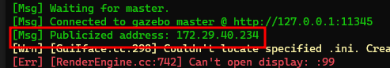

# Gazebo Simulation

We are experimenting with using simulation models to test software changes and potentially train pilots. This area still needs further development to be fleshed out more. 

TODO

## Dev Tool Setup for Simulation
This section assumes you already have [setup dev tools for PX4](PX4.md#dev-environment-setup).

Gazebo is a linux only application so we will be running it either through WSL 2 or natively on linux:

::: warning
If you plan to use Docker to run the simulation, there are only docker containers for Gazebo 9 and Gazebo 11. Local and Docker versions of gazebo must match to work correctly. The docker script will attempt to find the verison on you machine, otherwise it will default to Gazebo 9. You can check your local gazebo version by running `gazebo --version`
:::

### Windows with WSL 2
Depending what version of windows you are using, some additional setup may be needed

**Windows 11**
1. Open a terminal into Ubuntu
2. Install Gazebo 9 and Gazebo 9 dev files
    1. `sudo apt update`
    2. `sudo apt install gazebo9`
    3. `sudo apt install libgazebo9-dev`
3. Check that the Gazebo GUI launches by running `gazebo` GUI support for WSL 2 should be included in Windows 11.

**Windows 10**
1. In Windows, download and install VcXsrv, [SourceForge](https://sourceforge.net/projects/vcxsrv/)
2. Run and configure `Xlaunch` application from windows.
    - Select `multiple windows`, next
    - Select `Start no client`, next
    - Uncheck `native opengl` and check `Disable access control`, next
    - Save the configuration file somewhere accessible like your desktop. Run the configuration file to launch VcXsrv quickly in the future.
    - Finish
3. Open a terminal into ubuntu
4. Install Gazebo 9 and Gazebo 9 dev files
    1. `sudo apt update`
    2. `sudo apt install gazebo9`
    3. `sudo apt install libgazebo9-dev`
5. Add the following to the bottom of `~/.bashrc` using your favorite text editor (nano is easy if you have no preference)
    ```bash
    export GAZEBO_IP=127.0.0.1
    export DISPLAY=$(cat /etc/resolv.conf | grep nameserver | awk '{print $2}'):0
    export LIBGL_ALWAYS_INDIRECT=0
    ```
    - This configures the GUI to be forwarded to the VcXsrv and displayed by windows.
6. Run the following to reload .bashrc and make the changes take effect, `source ~/.bashrc`
7. Check that the Gazebo GUI launches by running `gazebo`

::: tip
You must go through the configuration for Xlauch every time you reboot windows.
You can save the configuration file on the last step in Xlaunch and run that instead to speed things up.
:::

### Ubuntu 18.04/20.04 Native/Virtual Machine
1. No additional setup required.


## Building PX4 and Running the Simulation

### Without Docker

**Ubuntu 18.04/20.04 Native/Virtual Machine**
1. Open a terminal to the root of the PX4 firmware
2. Run `make px4_sitl gazebo_open_uas` to build and launch the OpenUAS gazebo simulation


### Using Docker Toolchain
::: warning
There are only docker containers for Gazebo 9 and Gazebo 11. Local and Docker versions of gazebo must match to work correctly. The docker script will attempt to find the verison on you machine, otherwise it will default to Gazebo 9. You can check your local gazebo version by running `gazebo --version`
:::
**Linux**
1. Open a terminal to the root of the PX4 firmware
2. Run `./Tools/docker_run.sh make px4_sitl gazebo_open_uas` to build and launch the OpenUAS gazebo simulation server in docker
    - If you get compilation errors, it can be a good idea to run `./Tools/docker_run.sh make clean px4_sitl` to put the build process in a clean state
3. Open a new terminal and run `export GAZEBO_MASTER_IP=172.17.0.2`
    - This is the public IP address for the container we just made. The public IP address gazebo uses is printed out when the server first starts up in docker
    
    - This value can also be verified by running the following, substituting in the id of your new container
    ::: v-pre 
    `docker inspect --format '{{ .NetworkSettings.IPAddress }}' container_name_or_id` 
    ::: 
4. Run `export GAZEBO_MASTER_URI=$GAZEBO_MASTER_IP:11345`
5. Run `export GAZEBO_MODEL_PATH=~/git/PX4-Autopilot/Tools/sitl_gazebo/models/`
    - Replace first part of path as needed to point to your local PX4-Autopilot directory
6. Run `gzclient --verbose` to launch the gazebo GUI client, and connect to the docker server

**Windows with WSL2**
:::warning
Performance is currently an issue with Gazebo GUI running on WSL 2. Still investigating.

The issue comes from WSL 2 not using hardware acceleration when rendering GUI graphics. This could be better on Windows 11 but have not tested yet.
:::
::: details
**Gazebo working** under docker installed directly in WSL2 from docker [linux installation instructions](https://docs.docker.com/engine/install/ubuntu/). Had to run the docker container under the 'host' network to allow access to all the ports for gazebo to operate. Running under bridge with only port 11345 published did not work.

Current issue with configuration is performance, gazebo client running from WSL with docker gazebo server, sits at about 10 fps circling the iowa aeromodelers field when running maximized on my 21:9 monitor (smaller client resolution helps a lot). The performance drop from running gazebo server in docker compared to running gazebo client and server in wsl is minimal (1 to 2 FPS). However, running the same scenario on linux on bare metal with Nvidia drivers gives 62 fps. Additioanlly, running the docker container for the gazebo server on linux bare metal, does not significantly impact fps, so this is likely an issue with wsl.
:::


The Windows with WSL2 instructions are largely the same as the Linux instructions, except for running VcXsrv and steps 2 and 3.

- Step 0, if you're running on windows 10, make sure your xServer in windows is running by launching XLaunch or running your config file, see [Windows 10 setup](#windows-with-wsl-2)
- In step 2 instead run `DOCKER_OPTIONS="--network host" ./Tools/docker_run.sh make px4_sitl gazebo_open_uas`
- In step 3, the IP address may change between docker instances, check the address each time when gazebo server launches in docker
    - The IP changes due to running on the host network, but is required to get allow gazebo client to access all the ports it needs to, see [Question #166](https://github.com/gazebosim/gz-transport/issues/166) for more details.

